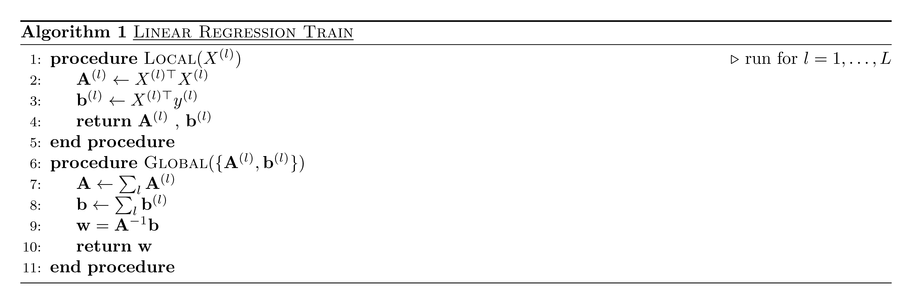

<b><h2>
Linear Regression
</h1></b>

<b><h4> Some General Remarks </h4></b>
The general architecture of the MIP follows a Master/Worker paradigm where many Workers, operating in multiple medical centers, are coordinated by one Master. Only Workers are allowed access to the anonymized data in each medical center and the Master only sees aggregate data, derived from the full data and sent to him by the Workers.

As a consequence, every algorithm has to be refactored in a form that fits this model.

In general, this means two things.

1. On the one hand, isolating the parts of the algorithm that operate on the full data and implement them in procedures that run on Workers.  
2. On the other hand, identifying the parts of the algorithm that need to see the aggregates from all Workers and implementing these parts in procedures that run on Master.

Our naming convention is that procedures run on Workers are given the adjective _local_ whereas those running on Master are called _global_.

<b><h4> Notation </h4></b>
Each local dataset *D(l)*, where *l*=1,...,*L*, is represented as a matrix of size *n* x *p*, where *L* is the number of medical centers, *n* is the number os points (patients) and *p* is the number of  attributes. The elements of the above matrix can either be continuous or discrete (categorical).

In each local dataset, the independent attributes are denoted as a matrix *X(l)* and the dependent variable is denoted as a vector *y(l)*. *x*(*ij*)(*l*) is the value of the *i*(*th*) patient of the *j*(*th*) attribute in the *l*(*th*) hospital, while *x*(*j*)(*l*) denotes the vector of the *j*(*th*) attribute in the *l*(*th*) hospital. For categorical attributes,  we use the notation *C*m  { *C*1, *C*2, ..., *C*M} for their domain.

<b><h4> Algorithm Description </h4></b>
Linear regression is a linear approach to modeling the relationship between a dependent variable and one or more independent variables. Here, _y_ should be numerical while _X_ should be continuous or categorical.

Once the process has been completed we compute the usual diagnostics as follows.
The local nodes compute and broadcast to the central node the quantities min(εi), max(εi), sum(εi), max(εi2), where εi are the residuals, as well as the partial *SST* and *SSE*. The central node then integrates these values to compute the corresponding global ones.
From these quantities the central node then computes the following diagnostic quantities:

1. For each coefficient βk, the *SE*, *t*-statistic and Pr(>|t|)
2. min, max, mean and SE of residuals εi and the degrees of freedom
3. R^2 and Adjusted R^2
4. *F*-statistic and *p*-value
